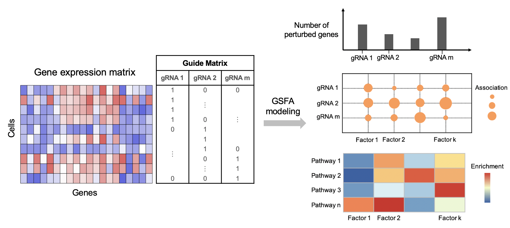

# GSFA

`GSFA` (Guided Sparse Factor Analysis) is an R package (accelerated by Rcpp) 
that performs sparse factor analysis and differential gene expression discovery 
simultaneously on single-cell RNA-seq with multiplexed CRISPR screen 
(e.g. CROP-seq, Perturb-seq) data.

The method assumes that the perturbation of a target gene affects certain latent 
factors (gene modules), which in turn alters the expression of individual genes. 
By fitting a Bayesian hierarchical model using Gibbs sampling, GSFA infers the 
latent factors and their associations with the perturbations in a joint statistical 
framework. 
It also summarizes the effects of a perturbation on individual genes as the sum 
of effects mediated by all the factors.

Provided with a normalized gene expression matrix and a perturbation matrix 
(of which cells contain which type of gRNAs) a single-cell CRISPR screening experiment, 
`GSFA` can   
(1) identify genetically controlled factors that are associated with the perturbation;    
(2) interpret the biological meanings of factors (gene modules) through gene 
ontology/pathway enrichment analysis thanks to the sparse gene weights on factors;    
(3) detect differentially expressed genes under each genetic perturbation by 
thresholding the local false sign rate (_LFSR_).



## Citing this work

If you find the GSFA package or any of the source code in this
repository useful for your work, please cite:

> Yifan Zhou, Kaixuan Luo, Mengjie Chen and Xin He. 
> A novel Bayesian factor analysis method improves detection of genes and 
> biological processes affected by perturbations in single-cell CRISPR screening. 
> [*bioRxiv* doi: 10.1101/2022.02.13.480282][biorxiv] (2022).

## License

All source code and software in this repository are made available
under the terms of the [MIT license][mit-license].

## Installation

### Github

To install the development version of the `GSFA` package from Github, run this in R:

```R
install.packages("devtools")
devtools::install_github("gradonion/GSFA", build_vignettes = TRUE)
```

### Source

If you have cloned the repository locally, you can install the package with the 
`install_local` function from devtools. Assuming you are in the local GSFA repository, 
run this code in R to install the package:

```R
devtools::install_local(build_vignettes = TRUE)
```

Note that installing the package will require a C++ compiler setup that is 
appropriate for the version of R installed on your computer.

### Docker

This R package and its C++ dependencies have all been containerized in a docker image. Run the code below to pull the docker image of the release version of `GSFA`. For more details, please see `Dockerfile` in this repository. 

```
docker pull gradonion/gsfa:latest
```

Once pulled, run the docker image and execute it in interactive mode to execute the vignettes or your own analysis. At the current time, there is no RStudio Server support in the docker image above, and will be adding it in the near future.

## Using the package

Please see this package vignette for using GSFA on a simulated example:

```R
library(GSFA)
vignette("gsfa_intro")
```

For guidance on using GSFA to analyze and interpret real single-cell CRISPR screen 
data, please refer to the code and examples in this [repository][paper_github].

## Credits

The GSFA package is developed by Yifan Zhou from the
[He Lab](http://xinhelab.org) at the University of Chicago.

[biorxiv]: https://www.biorxiv.org/content/10.1101/2022.02.13.480282v1
[mit-license]: https://opensource.org/licenses/mit-license.html
[paper_github]: https://github.com/gradonion/GSFA_paper/
